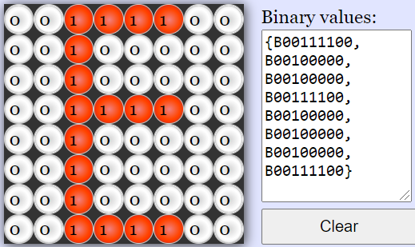
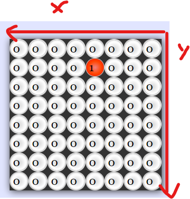
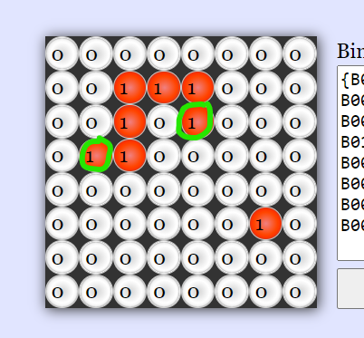
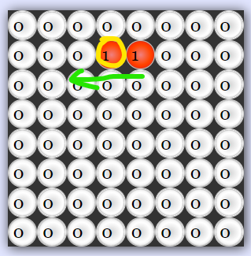

# Lý thuyết game snek
## Hiển thị
Để hiển thị snek lên led matrix 8x8 thì ta coi mỗi một led trong matrix này là 1 bit với mỗi hàng là một byte:  
ví dụ để hiện chữ E.

Giờ theo cái này ta lưu trạng thái hiển thị của game dưới dạng 8 byte với mỗi byte tương ứng với 1 hàng, các giá trị này sẽ được lưu vào địa chỉ DISP_START_ADDR tại 0x20 tới DISP_END_ADDR tại 0x27 

Tiếp theo, dể một vật di chuyển trên display thì phải có một hệ thống trục tọa độ xy. Mỗi khi vật đi sang trái hoặc sang phải, sẽ tương đương với việc x của vật thay đổi, và mỗi khi thay đổi tọa độ thì màn hình sẽ được "vẽ" lại để hiển thị lại vị trí của vật tạo cảm giác vật di chuyển.

2 giá trị xy này sẽ được lưu dưới dạng 1 byte. Ví dụ: giá trị tọa độ của 1 vật là 0x24 = 0010 0100 <=> y = 2, x = 4.

## Snek
Để vẽ một con snek, ta cần phải biết độ dài của con snek (lưu tại SNAKE_LENGTH_PTR), vị trí đầu hoặc vị trí đuôi của snek (lưu tại SNAKE_TAIL) và hướng snek đang di chuyển(lưu tại SNAKE_DIR). Vị trí của mỗi bit của con snek sẽ được lưu trong khoảng từ SNAKE_TAIL là 0x33H trở đi (34H, 35H, ...) với mỗi lần con snek dài ra 

Con snek bắt đầu với độ dài chỉ 2 bit. Lúc này ta lưu giá trị vị trí xy của đuôi snek tại địa chỉ SNAKE_TAIL 0x33 ( ví dụ giá trị bằng 0x24 như bên trên ), với độ dài là 2 tại địa chỉ SNAKE_LENGTH_PTR. Lúc này vị trí đầu của snek sẽ được lưu tại địa chỉ SNAKE_TAIL + chiều dài snek - 1 = 0x33 + 2 - 1 = 0x34. chúng ta sẽ khởi tạo giá trị đầu tại 0x34 là 0x25 và SNAKE_DIR sẽ có giá trị = 3 tương đương với việc đi sang trái.

*Đầu con snek đc khoanh vàng và có hướng di chuyển màu xanh lá*

## Loop
Trong mỗi vòng lặp

- check state của nút bấm  
`MOV CURR_KEY_STATES, KEYPAD_PORT`
- dựa theo state chuyển hướng di chuyển  
`LCALL _get_input_update_new_direction`
- xóa trắng display   
`ACALL _clear_display_buffer`
- đặt vị trí snake vào bộ nhớ  
`ACALL _set_snake`
- đặt vị trí egg vào bộ nhớ  
`ACALL _place_snake_egg`
- cập nhật vị trí đầu snek dựa theo hướng di chuyển hiện tại  
`ACALL _update_head`
- kiểm tra nếu snek ăn đc egg  
`ACALL _check_if_head_coincides_with_egg`
- cập nhật toàn bộ vị trí của từng bit trên con snek (1 con snek có nhiều bit, vị trí của mỗi bit lưu tại địa chỉ 0x33,0x34, 0x35 tùy độ dài snek)  
`ACALL _update_snake_array`
- kiểm tra nếu snek tự bóp dái  
`ACALL _check_if_snake_ate_itself`
- nếu bóp dái thì nhảy tới gameover function  
JZ over
- nếu ko thì tiếp tục viết score lên lcd   
`ACALL _write_score_to_lcd`
- vẽ toàn bộ data lên led matrix  
`ACALL _display`

## Giải thích các hàm
